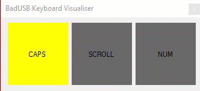

# BadUSB - KeyboardLightCheck

Simple .NET app to show the status of keyboard locks.
My laptop has no indicators, nor does the OSK for Windows 10. Usful for testing the BadUsb is tumbing the keys

##Demo
